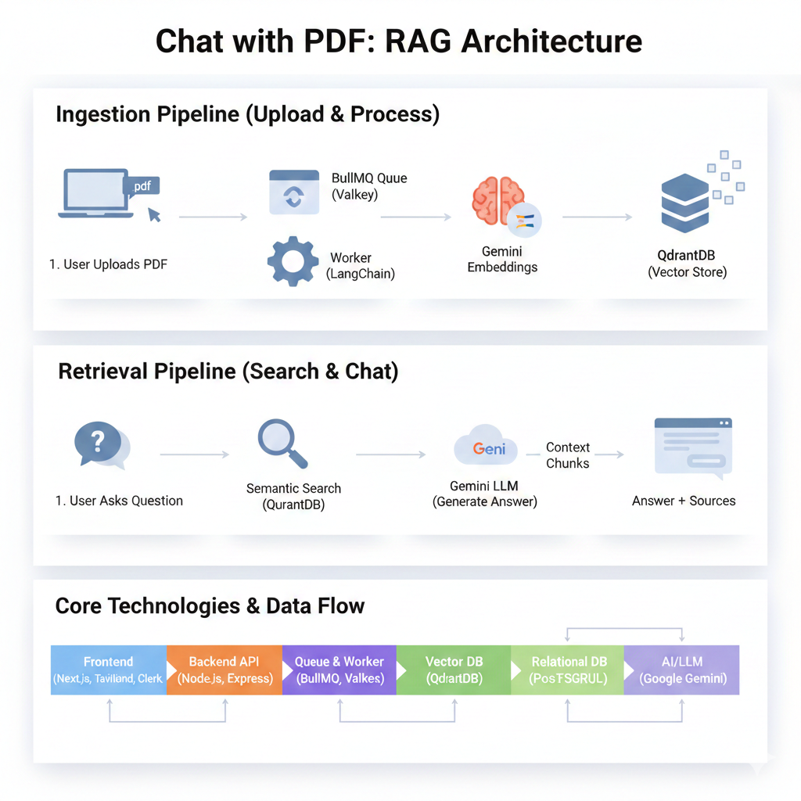

# Chat with PDF


A web application that lets users upload PDF documents and interact with them through an AI-powered chat interface. Instead of manually scanning pages, users ask natural-language questions and receive instant, context-aware answers derived from the uploaded documents.

## About this project

This project demonstrates a Retrieval-Augmented Generation (RAG) workflow for document question-answering. PDFs are uploaded, processed into retrievable vectors, and stored in a vector database. When a user asks a question, the system retrieves relevant passages and feeds them to a language model to produce accurate, source-grounded responses.

Use cases:
- Quickly find answers in long reports, manuals, or research papers
- Build searchable knowledge bases from company documents
- Prototype document-aware chat assistants

## Features

- Upload and index PDF documents
- Natural-language Q&A across uploaded documents
- Source-aware answers with referenced passages
- Authentication and user sessions
- Scalable workers for ingestion and vectorization

## Tech Stack

- Frontend: Next.js (app router), React
- Auth: Clerk
- Worker/Queue: BullMQ
- Vector DB: Qdrant (or similar)
- AI: LLM + vector retrieval (RAG pattern)
- Containerization: Docker (optional)

## Quickstart (development)

1. Install dependencies for `client` and `server`:

```bash
# from repository root
cd client
npm install
cd ../server
npm install
```

2. Start development servers (run in separate terminals):

```bash
# client
cd client
npm run dev

# server
cd server
node index.js
```

3. Open the app in your browser at `http://localhost:3000` (Next.js default).

## Contributing

Contributions welcome — open an issue or PR with improvements or bug fixes.

## License

This project doesn't include a license file. Add one if you plan to publish.

## Architecture

This application implements a Retrieval-Augmented Generation (RAG) pattern:

- Ingestion: Uploaded PDFs are parsed and chunked into passages.
- Vectorization: Passages are converted to embeddings and stored in a vector database (e.g., Qdrant).
- Retrieval: At query time, relevant passages are retrieved by vector similarity.
- Generation: Retrieved context is fed to a language model to produce concise, source-grounded answers.

The system is organized into a web frontend (`client`), an API server (`server`), and background workers for ingestion and vectorization.

## How it Works

The application operates through two main pipelines: **Ingestion** (processing uploaded PDFs) and **Retrieval** (answering user questions). Here's a detailed breakdown of each step:

### 1. Ingestion Pipeline (Upload & Process)

When a user uploads a PDF document, the following steps occur:

**Step 1: User Uploads PDF**
- The user selects and uploads a PDF file through the Next.js frontend interface
- The file is sent to the backend API server via HTTP POST request

**Step 2: Queue Job Creation**
- The backend API receives the PDF and creates a processing job
- The job is added to a **BullMQ queue** (using Valkey/Redis as the message broker)
- This asynchronous approach prevents blocking the UI while processing large documents

**Step 3: Background Worker Processing**
- A dedicated worker process (using LangChain) picks up the job from the queue
- The worker extracts text content from the PDF
- The document is split into smaller, semantically meaningful chunks (passages)
- This chunking ensures better retrieval accuracy and fits within LLM context limits

**Step 4: Generate Embeddings**
- Each text chunk is converted into a vector embedding using **Google Gemini's embedding model**
- Embeddings are numerical representations that capture the semantic meaning of the text
- Similar content will have similar vector representations

**Step 5: Store in Vector Database**
- The embeddings, along with their original text chunks and metadata, are stored in **QdrantDB**
- Qdrant is a vector database optimized for similarity search
- The document is now indexed and ready for querying

### 2. Retrieval Pipeline (Search & Chat)

When a user asks a question about their uploaded documents:

**Step 1: User Asks Question**
- The user types a natural language question in the chat interface
- The question is sent to the backend API

**Step 2: Semantic Search**
- The user's question is converted into a vector embedding (using the same Gemini model)
- QdrantDB performs a **semantic similarity search** to find the most relevant text chunks
- Unlike keyword search, this finds passages that are conceptually related to the question
- The top-k most relevant chunks are retrieved (typically 3-5 passages)

**Step 3: Generate Answer with Context**
- The retrieved text chunks are combined with the user's question
- This combined context is sent to the **Gemini LLM** (Large Language Model)
- The LLM generates a natural, accurate answer based on the provided context
- The answer is grounded in the actual document content, reducing hallucinations

**Step 4: Return Answer with Sources**
- The generated answer is sent back to the frontend
- Source references (which chunks were used) are included
- The user sees the answer along with citations to the original document sections

### Architecture Diagram



The diagram above illustrates the complete data flow through both pipelines, showing how different technologies work together to enable intelligent document chat.

## Project structure

- `client/` — Next.js frontend (app router), authentication, UI components.
- `server/` — Express/Node API, upload endpoints, worker orchestration.
- `controller/` — High-level request handlers used by the server and workers.
- `uploads/` — Temporary storage for uploaded PDFs (can be backed by persistent storage in production).
- `docker-compose.yml` — Optional local orchestration for services (vector DB, server, worker, etc.).

## Environment variables

Create `.env` files for `client` and `server`. Typical variables:

- For `client` (Next.js):
	- `NEXT_PUBLIC_API_URL` — URL of the backend API (e.g., `http://localhost:8080`).
	- `NEXT_PUBLIC_CLERK_PUBLISHABLE_KEY` — Clerk public key for auth (if using Clerk).

- For `server`:
	- `PORT` — Server port (e.g., `8080`).
	- `CLERK_SECRET_KEY` — Clerk secret key (if using Clerk server-side features).
	- `VECTOR_DB_URL` — Connection URL for the vector database (Qdrant endpoint).
	- `OPENAI_API_KEY` (or other LLM provider key) — Key for calling the language model.
	- `REDIS_URL` — Redis endpoint for BullMQ if used.

Store secrets securely for production (Secrets Manager, environment, or CI variables).

## Running locally (expanded)

1. Install dependencies for `client` and `server`:

```bash
# from repository root
cd client
npm install
cd ../server
npm install
```

2. Start services (example):

```bash
# start backend
cd server
node index.js

# start frontend
cd ../client
npm run dev
```

3. Optional: start vector DB and Redis with `docker-compose up` if `docker-compose.yml` is configured.

## Deployment notes

- Use the included `docker-compose.yml` for simple deployments of the API, worker, and vector DB.
- For production, deploy the `client` (Next.js) to Vercel or a static host and the `server` to a container service (AWS ECS, DigitalOcean App Platform, etc.).
- Ensure environment variables and secrets are set in your hosting platform.

## Testing

- Add unit and integration tests for the backend API and ingestion worker as you expand features.
- For frontend, use React Testing Library and Playwright or Cypress for end-to-end flows.

## Troubleshooting

- If uploads fail, confirm `uploads/` folder permissions and that `server` accepts large request bodies.
- If retrieval returns poor results, check embedding generation, chunk size, and the vector DB indexing settings.

## Contact

If you have questions or want help extending this project, open an issue or reach out in the repository.


